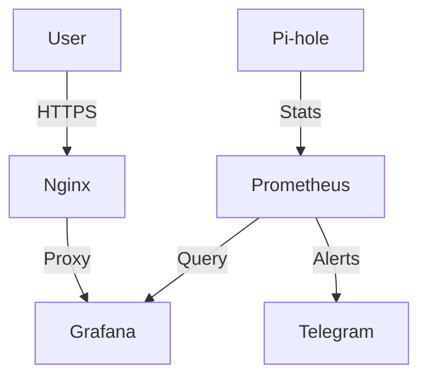

#  Pi-hole DNS and Linux Monitoring

<p align="center">
  
  
  
  
</p>

> **Pi-hole Live Dashboard:** [https://serverdashboard.qzz.io](https://serverdashboard.qzz.io/d/edknpuskjzw1sc/)  
> **System Health Dashboard:** [https://serverdashboard.qzz.io/metrics](https://serverdashboard.qzz.io/d/edknpuskjzw1sc/)

### Network Security and Infrastructure Reliability

This repo shows how I monitor my demo home lab's Pi-hole ad-block and DNS on a Linux server. I'm using Prometheus to collect metrics and Grafana to visualize DNS queries and system stats (CPU, RAM, Disk) in real-time, with Nginx handling SSL to keep the dashboard secure.

---

## Project Overview

I built this system to improve my overall internet experience, which had become increasingly unusable without an effective ad-blocker. This provides network-wide ad-blocking and tracker protection via Pi-hole DNS. By acting as the DNS sinkhole for my entire network, it strips away advertisements at the DNS level before they ever reach any of my devices, significantly improving my internet experience.

I also integrated system monitoring alongside Pi-hole statistics. Now I can easily tell how effectively Pi-hole is filtering traffic while also monitoring the health and stability of the server at a glance all from the dashboard. It is so easy to manage the system and quickly spot any issues without having to query anything.

## The Stack
- **DNS Sinkhole:** Pi-hole
- **Reverse Proxy:** Nginx (SSL/TLS Termination)
- **VPN:** WireGuard 
- **Metrics Collection:** Prometheus
- **Exporters:**
  - `pihole-exporter` - DNS stats
  - `node_exporter` - System stats
- **Visualization:** Grafana
- **Alerting:** Alertmanager - Via Telegram

---

##  Dashboard Insights

### 1. [Pi-hole DNS Performance](https://serverdashboard.qzz.io/d/edknpuskjzw1sc/)
Real-time monitoring of DNS traffic and filtering efficiency. Key metrics tracked include:
- **Network Summary:** Total Queries, Active Clients and Domains on Blocklist.
- **Filtering Impact:** Tracking of Blocked Queries and total Ads Blocked.
- **Query Status:** Breakdown of Cache hits.
- **Upstream Performance:** Monitoring of Upstream DNS Response Times.

<blockquote>
  <a href="https://serverdashboard.qzz.io/d/edknpuskjzw1sc/">
    
  </a>
</blockquote>

### 2. [System Health](https://serverdashboard.qzz.io/d/rYdddlPWk/)
Keeps track of the server's resources to prevent issues:
- **CPU Load:** Breakdown of System vs. User load.
- **Memory Usage:** RAM usage and swap tracking.
- **Disk Usage:** Real-time capacity monitoring.

<blockquote>
  <a href="https://serverdashboard.qzz.io/d/rYdddlPWk/">
    
  </a>
</blockquote>

---

##  Alerting Policies

I also set up alerts to ping me on **Telegram** if the server gets overloaded.

| Metric | Threshold | Duration | Notification Channel |
| :--- | :--- | :--- | :--- |
| **High CPU Usage** | > 80% | > 2 Minutes |  Telegram |
| **High RAM Usage** | > 80% | > 2 Minutes |  Telegram |
| **Low Disk Space** | > 90% | - |  Telegram |

*The 2-minute delay ensures I don't get annoyed by random quick spikes.*

---

## Architecture

This system uses a standard Prometheus pull-based architecture, securely exposed via Nginx.



- **Pi-hole**: Core DNS ad-blocker.
- **Prometheus**: Time-series database that scrapes metrics from the server.
- **Grafana**: Visualization layer for building real-time dashboards.
- **Exporters**: `node_exporter` (System stats) and `pihole_exporter` (DNS stats).
- **Security**: **Nginx** handles SSL/TLS termination for secure remote access.
- **Alerting**: Alertmanager integration for **Telegram** notifications.

---


##  Deployment and Setup

To get this monitoring stack running, you'll need these main apps installed. I recommend using **Docker** for all of them to keep things simple.

### 1. Core Services Installation

- **[Pi-hole](https://pi-hole.net/)**: Set this up first as your primary DNS. Point WireGuard to it.
- **[WireGuard](https://www.wireguard.com/)**:  VPN to point traffic to.
- **[Prometheus](https://prometheus.io/)**: The database that collects and stores metrics.
- **[Grafana](https://grafana.com/oss/grafana/)**: The dashboard tool used to visualize all the data.

### 2. Pointing Traffic to the Ad-block
To actually use your new setup, you need to tell your devices where to look:
- **For your Home Network**: Change your Router's DNS settings to point to your Server's IP address.
- **For WireGuard**: In your WireGuard client config `.conf`, set `DNS = <Your_Pihole_IP>`. This ensures the device uses Pi-hole even when you are on public Wi-Fi or Mobile data.

### 3. Setting Up Exporters
Exporters take data from your apps and hand it over to Prometheus.


- **Node Exporter**: Install this on your server port `9100` to track system health like CPU, RAM and Disk usage.
- **Pi-hole Exporter**: I use the [ekofr/pihole-exporter](https://github.com/ekofr/pihole-exporter). You'll need to provide your Pi-hole API token so it can read your DNS stats. (found in Settings > API) and usually runs on port `9617`.

### 4. Configure Prometheus
Update your `prometheus.yml` to start scraping data from your exporters:
```yaml
scrape_configs:
  - job_name: 'node'
    static_configs:
      - targets: ['localhost:9100']

  - job_name: 'pihole'
    static_configs:
      - targets: ['localhost:9617']
```

### 5. Importing Dashboards to Gafana
1. Open Grafana and go to **Dashboards > Import**.
2. **For Pi-hole**: Upload the `pihole-stats.json` file from this repository.
3. **For System Health**: I recommend using the [Node Exporter Full](https://grafana.com/grafana/dashboards/1860-node-exporter-full/) dashboard.
4. Then select prometheus as datasource.
   

### 6. Secure with Nginx
Use **Nginx** as a reverse proxy to add SSL (HTTPS). This keeps your connection to the server secure when you access it outside of your network.


---

## 📝 License
Distributed under the MIT License. See `LICENSE` for more information.