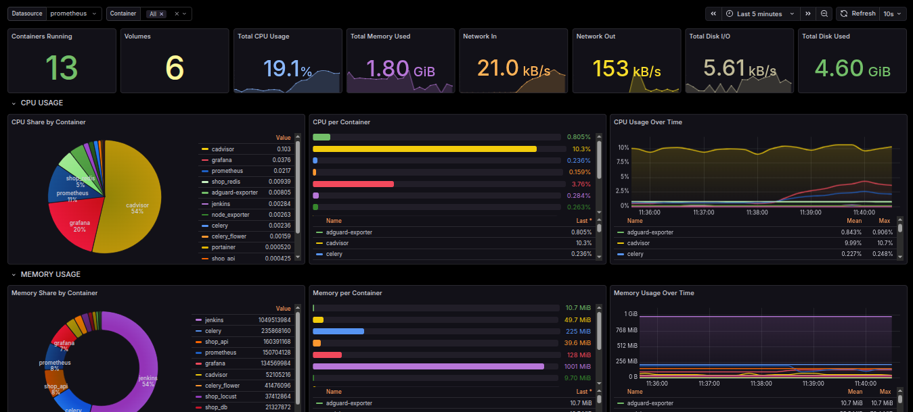
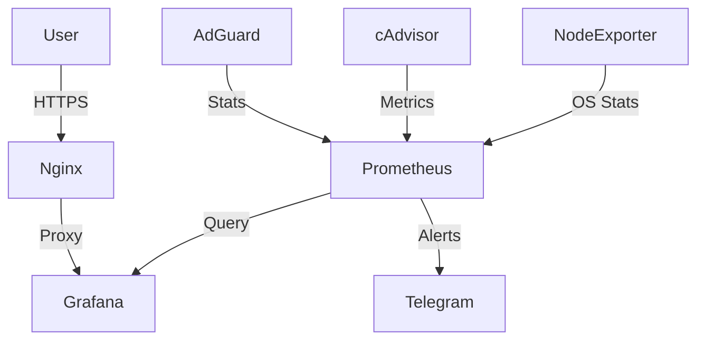

#  HomeLab Monitoring Stack

<p align="center">
  
  
  
  
</p>

> **AdGuard Home Dashboard:** [https://serverdashboard.qzz.io/adguard](https://serverdashboard.qzz.io/adguard)

> **System Health Dashboard:** [https://serverdashboard.qzz.io/metrics](https://serverdashboard.qzz.io/metrics)

> **Docker Containers Dashboard:** [https://serverdashboard.qzz.io/docker](https://serverdashboard.qzz.io/docker)

### Network Security, Container Orchestration and Infrastructure Reliability

This repo shows how I monitor my HomeLab Linux server. I'm using Prometheus to collect metrics and Grafana to visualize DNS queries, Docker container stats and system health. Nginx is handling SSL to keep the dashboards secure.

---

## Project Overview

I built this system to improve my overall internet experience which had become increasingly unsuable without an effective ad-blocker. This setup provides network-wide ad-blocking via AdGuard Home and visibility into every Docker container running on the server.

By integrating AdGuard, Docker and system monitoring, I can easily tell how effectively the network is filtered while also monitoring the resource consumption and health of every service.

## The Stack
- **DNS Sinkhole:** AdGuard Home
- **Containerization:** Docker
- **Reverse Proxy:** Nginx (SSL/TLS Termination)
- **VPN:** Tailscale
- **Metrics Collection:** Prometheus
- **Exporters:**
  - `adguard-exporter` - DNS stats
  - `node_exporter` - System stats
  - `cAdvisor` - Docker container metrics
- **Visualization:** Grafana
- **Alerting:** Alertmanager - Via Telegram

---

##  Dashboard Insights

### 1. [AdGuard Home DNS](https://serverdashboard.qzz.io/)
Real-time monitoring of DNS traffic and filtering efficiency.
- **Network Summary:** Total Queries and Blocked Domains.
- **Filtering Impact:** Tracking of Blocked Queries and Ads Blocked.
- **Performance:** Monitoring of Upstream DNS Response Times.

<blockquote>
  <a href="https://serverdashboard.qzz.io/">
    
  </a>
</blockquote>

### 2. [Docker Containers](https://serverdashboard.qzz.io/d/homelab-docker?orgId=1&kiosk)
Detailed monitoring of containerized services:
- **Service Health:** Running and Uptime tracking.
- **Resource Usage:** CPU and Memory share per container.
- **Network & I/O:** Real-time throughput and Disk I/O per service.

<blockquote>
  <a href="https://serverdashboard.qzz.io/d/homelab-docker">
    
  </a>
</blockquote>

### 3. [System Health](https://serverdashboard.qzz.io/d/system?kiosk)
Keeps track of the server's physical resources:
- **CPU Load:** Breakdown of System load.
- **Memory Usage:** RAM usage and swap tracking.
- **Disk Usage:** Disk capacity monitoring.

<blockquote>
  <a href="https://serverdashboard.qzz.io/d/rYdddlP/node-exporter-full">
    
  </a>
</blockquote>

---

##  Alerting Policies

I also set up alerts to ping me on **Telegram** if the server or containers get overloaded.

| Metric | Threshold | Duration | Notification Channel |
| :--- | :--- | :--- | :--- |
| **High CPU Usage** | > 80% | > 2 Minutes |  Telegram |
| **High RAM Usage** | > 80% | > 2 Minutes |  Telegram |
| **Container Down** | 1 -> 0 | - |  Telegram |
| **Low Disk Space** | > 90% | - |  Telegram |

---

## Architecture

This system uses a standard Prometheus pull-based architecture, securely exposed via Nginx.



---

##  Deployment and Setup

### 1. Core Services Installation

- **[AdGuard Home](https://adguard.com/en/adguard-home/overview.html)**: Primary DNS sinkhole.
- **[Prometheus](https://prometheus.io/)**: Time-series database for metrics.
- **[Grafana](https://grafana.com/oss/grafana/)**: Visualization and dashboarding.
- **[Tailscale](https://tailscale.com/)**: Secure remote access.

### 2. Setting Up Exporters

- **Node Exporter**: Install on port `9100` for system health.
- **AdGuard Exporter**:I use [adguard-exporter](https://github.com/henrywhitaker3/adguard-exporter) on port `9617`.
- **cAdvisor**: For Docker metrics, run cAdvisor in a container to expose stats on port `8080`.

### 3. Configure Prometheus
Update your `prometheus.yml`:
```yaml
scrape_configs:
  - job_name: 'node'
    static_configs:
      - targets: ['localhost:9100']

  - job_name: 'adguard'
    static_configs:
      - targets: ['localhost:9617']

  - job_name: 'cadvisor'
    static_configs:
      - targets: ['localhost:8080']
```

### 4. Importing Dashboards
1. Open Grafana and go to **Dashboards > Import**.
2. **AdGuard Home**: Import `AdGuard-DNS-stats.json`.
3. **Docker Containers**: Import `Docker-Monitoring.json`.
4. **System Monitor**: Import `System-Monitor.json`.


---

## 📝 License
Distributed under the MIT License. See `LICENSE` for more information.